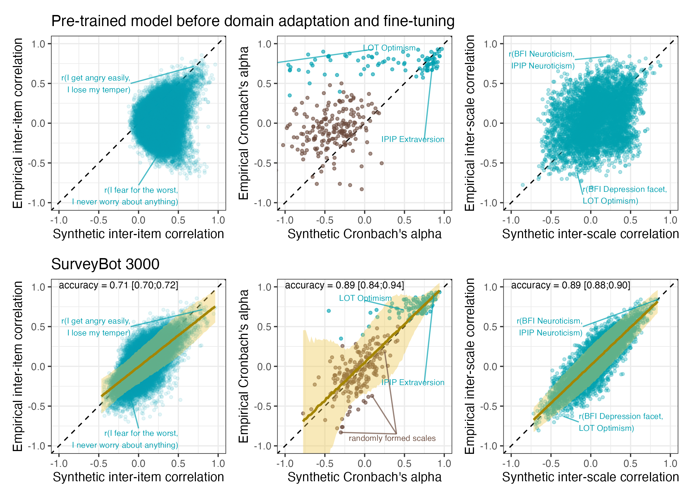

## Table of contents

### Pilot Study
- [Import and prepare data](docs/1_vector_to_cosine.html)
- [Pilot Study Results](docs/validation_study.html)
  - [Interactive Item Plot](docs/2_interactive_item_plot.html)

### Registered Report Stage 1
- [Registered Report Precision Simulations](docs/3_rr_precision_simulations.html)
 
### Validation Study
- [Import and prepare data](docs/1_import_validation_study.html)
- [Codebook](docs/codebook.html)
- [Validation Study Results](docs/validation_study.html)
  - [Interactive Item Plot (Registered Report)](docs/2_interactive_item_plot_rr.html)

