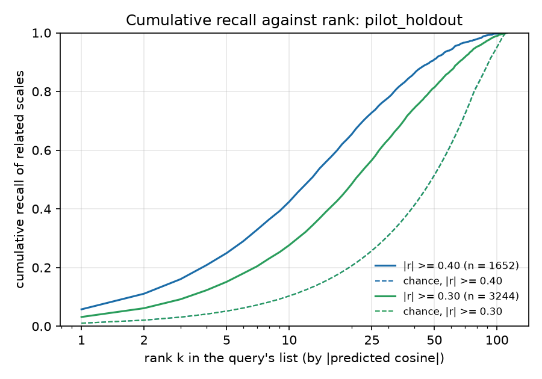
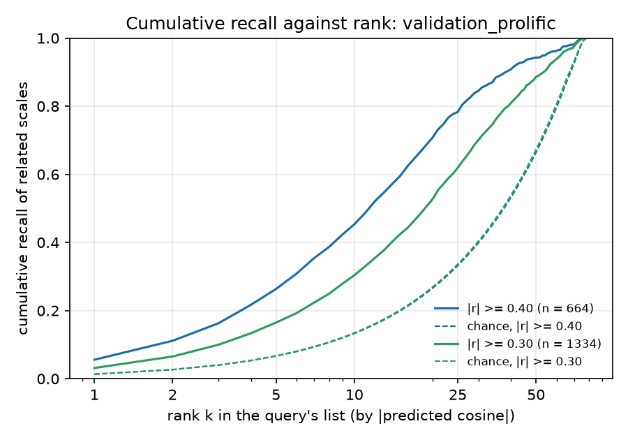

# Rank-based recall of related scales (variant B, cross-instrument)

For each query scale, cross-instrument database scales are ranked by |predicted cosine|. Each related pair enters twice (once per direction). Chance = expected share under random ordering, min(k, list size) / list size averaged over pairs; it reaches 1 once k covers the whole list (lists have about 65 to 112 entries). Median rank is kept in rank_recall.csv.

## pilot_holdout

113 query scales, list sizes 78 to 112.

| threshold | related pairs | queries | top 5 | top 10 | top 25 | top 50 | top 100 |
|---|---|---|---|---|---|---|---|
| |r| >= 0.40 | 1652 | 110 | 0.25 (chance 0.05) | 0.42 (chance 0.10) | 0.73 (chance 0.26) | 0.91 (chance 0.52) | 1.00 (chance 0.95) |
| |r| >= 0.30 | 3244 | 113 | 0.15 (chance 0.05) | 0.28 (chance 0.10) | 0.57 (chance 0.26) | 0.81 (chance 0.51) | 0.99 (chance 0.95) |

## validation_prolific

80 query scales, list sizes 65 to 79.

| threshold | related pairs | queries | top 5 | top 10 | top 25 | top 50 | top 100 |
|---|---|---|---|---|---|---|---|
| |r| >= 0.40 | 664 | 52 | 0.26 (chance 0.07) | 0.45 (chance 0.13) | 0.78 (chance 0.33) | 0.94 (chance 0.66) | 1.00 (chance 1.00) |
| |r| >= 0.30 | 1334 | 74 | 0.16 (chance 0.07) | 0.30 (chance 0.13) | 0.62 (chance 0.34) | 0.89 (chance 0.67) | 1.00 (chance 1.00) |

