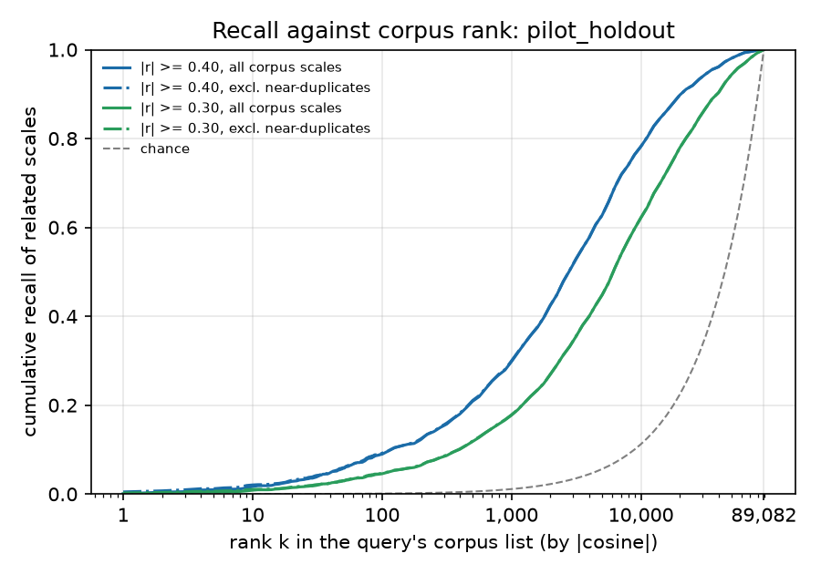
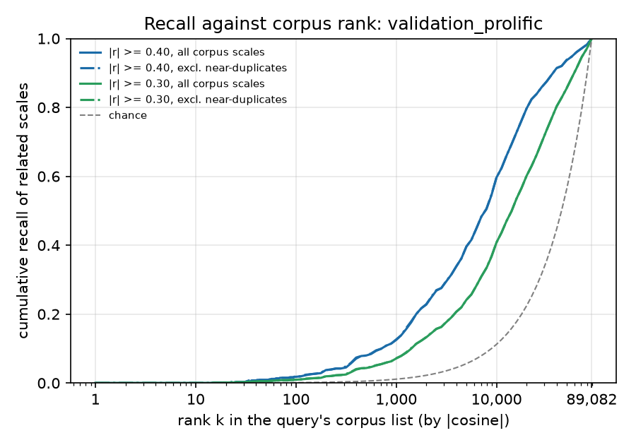

# Rank-based recall extrapolated to the SynthNet corpus (variant B, cross-instrument)

Corpus: 89,082 scale vectors (29,758 instruments, 59,324 subscales), re-pooled with variant B from item embeddings and keying. For each related validation pair the rank the database scale would have among all corpus scales is 1 + the number of corpus scales with a higher |cosine| to the query than the pair's predicted |cosine|. 'excl. near-duplicates' drops corpus scales with |cosine| >= 0.8 to the query. Chance = k / corpus size. Pessimistic: corpus scales that outrank a related scale may themselves be related to the query.

## pilot_holdout

113 query scales. Corpus scales per query with |cosine| >= .40: median 2401 (IQR 488 to 4287); >= .30: median 8772; >= 0.8 (near-duplicates): median 1, max 38.

| threshold | ranking | related pairs | median corpus rank | top 5 | top 10 | top 25 | top 50 | top 100 | top 250 | top 1000 |
|---|---|---|---|---|---|---|---|---|---|---|
| |r| >= 0.40 | all corpus scales | 1652 | 2760 | 0.01 | 0.02 | 0.03 | 0.06 | 0.09 | 0.14 | 0.30 |
| |r| >= 0.40 | excl. near-duplicates | 1652 | 2745 | 0.01 | 0.02 | 0.04 | 0.06 | 0.09 | 0.14 | 0.30 |
| |r| >= 0.30 | all corpus scales | 3244 | 6036 | 0.00 | 0.01 | 0.02 | 0.03 | 0.05 | 0.08 | 0.18 |
| |r| >= 0.30 | excl. near-duplicates | 3244 | 6033 | 0.01 | 0.01 | 0.02 | 0.03 | 0.05 | 0.08 | 0.18 |

Chance at k: top 5 = 0.0001, top 10 = 0.0001, top 25 = 0.0003, top 50 = 0.0006, top 100 = 0.0011, top 250 = 0.0028, top 1000 = 0.0112.

## validation_prolific

80 query scales. Corpus scales per query with |cosine| >= .40: median 346 (IQR 53 to 3352); >= .30: median 2616; >= 0.8 (near-duplicates): median 0, max 67.

| threshold | ranking | related pairs | median corpus rank | top 5 | top 10 | top 25 | top 50 | top 100 | top 250 | top 1000 |
|---|---|---|---|---|---|---|---|---|---|---|
| |r| >= 0.40 | all corpus scales | 664 | 7846 | 0.00 | 0.00 | 0.00 | 0.01 | 0.02 | 0.04 | 0.12 |
| |r| >= 0.40 | excl. near-duplicates | 664 | 7844 | 0.00 | 0.00 | 0.00 | 0.01 | 0.02 | 0.04 | 0.13 |
| |r| >= 0.30 | all corpus scales | 1334 | 14245 | 0.00 | 0.00 | 0.00 | 0.01 | 0.01 | 0.02 | 0.07 |
| |r| >= 0.30 | excl. near-duplicates | 1334 | 14232 | 0.00 | 0.00 | 0.00 | 0.01 | 0.01 | 0.02 | 0.07 |

Chance at k: top 5 = 0.0001, top 10 = 0.0001, top 25 = 0.0003, top 50 = 0.0006, top 100 = 0.0011, top 250 = 0.0028, top 1000 = 0.0112.

